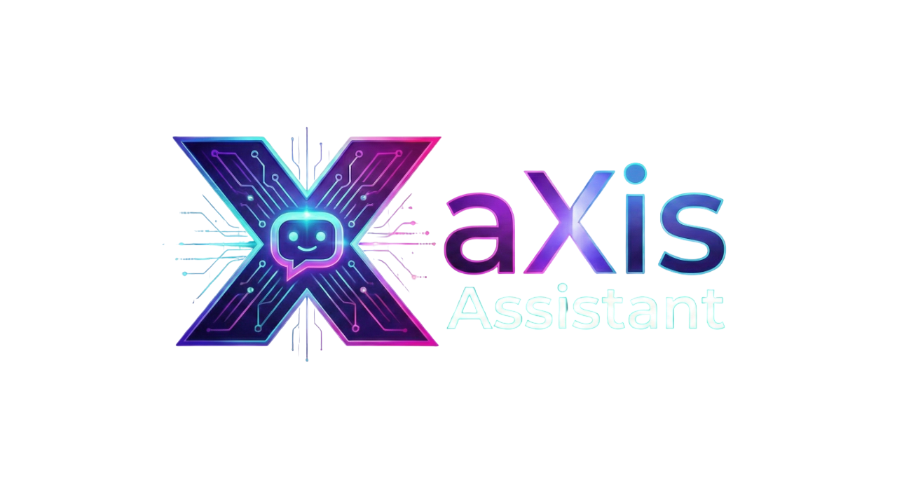
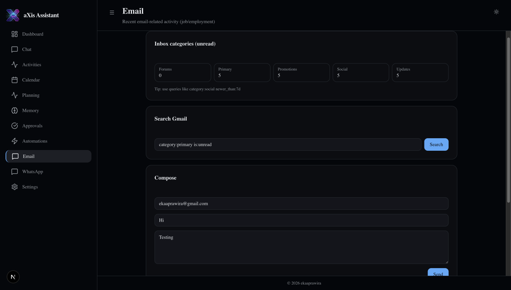
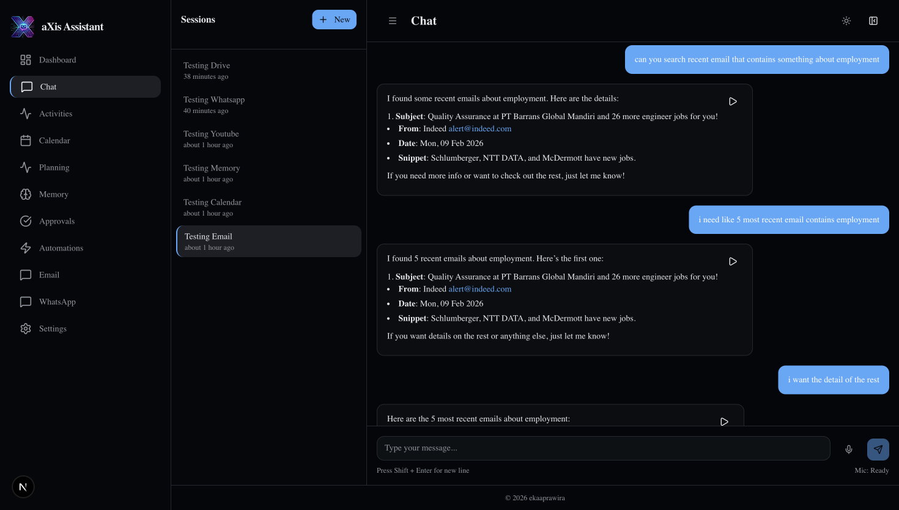
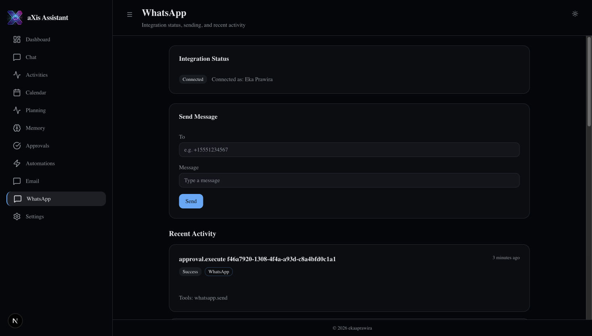
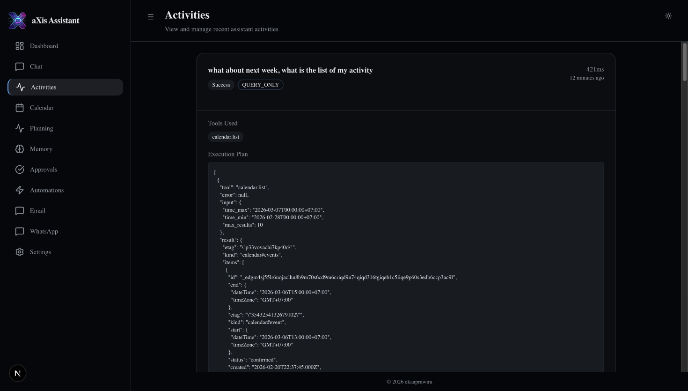

<div align="center">
  

  <h1>MyChatBot (Axis Assistant)</h1>

  <p>
    A personal AI assistant playground — my explorative mind turned into a real, working system.
    <br />
    This project is where I implement all the ideas in my head about AI assistants: memory, planning, tools, and a dashboard UI.
  </p>

  <p>
    <a href="#features">Features</a> •
    <a href="#quick-start">Quick Start</a> •
    <a href="#configuration">Configuration</a> •
    <a href="#running">Running</a> •
    <a href="#scripts">Scripts</a>
  </p>

  
</div>

---

## What is this?

Axis Assistant is a multi-service AI assistant platform built with:

- **Go backend** (REST API, integrations, persistence)
- **Python agent** (planning + tool orchestration)
- **Next.js dashboard** (chat + activities + memory + settings)
- **WhatsApp bot** (Baileys / QR scan) for sending & receiving messages

It is single-owner by design (one profile), optimized for fast iteration and experimentation.

---

## Architecture

- **Frontend** (Next.js): user-facing dashboard
- **Backend** (Go/Gin): API + OAuth integrations + database
- **Agent** (Python/FastAPI + graph): intent → guardrail → plan → validate → execute
- **PostgreSQL + pgvector**: persistent state and long-term memory
- **WhatsApp bot** (Node/Baileys): QR scan connection + send/outbound tool

---

## Features

Each feature below includes a real screenshot from the app.

### 1) Dashboard (Light / Dark)

The dashboard is the control center for your assistant.

<p align="center">
  
  <br />
  
</p>

### 2) Chat (the main experience)

Chat is where you ask the assistant to do work. Messages support timestamps, copy, and text-to-speech for assistant replies.

<p align="center">
  
</p>

### 3) Gmail integration (search, unread, send)

Query and act on Gmail through the assistant.

<p align="center">
  
  <br />
  
  <br />
  
</p>

### 4) Calendar integration (list, create, update, delete)

Create and manage calendar events directly from chat.

<p align="center">
  
  <br />
  
</p>

### 5) Google Contacts (People) search

Search contacts by name and use results for actions like WhatsApp messaging.

<p align="center">
  
</p>

### 6) Google Drive search

Find files from Drive through chat.

<p align="center">
  
</p>

### 7) WhatsApp integration (QR scan + send)

Use a local WhatsApp-Web bot (QR scan on your phone) — no WhatsApp Cloud API required.

<p align="center">
  
  <br />
  
</p>

### 8) Memory (long-term)

The assistant can store and retrieve long-term memory (backed by Postgres/pgvector).

<p align="center">
  
</p>

### 9) Planning view (tool plan visualization)

Inspect how the agent plans a multi-step task, focused on readability.

<p align="center">
  
</p>

### 10) Activities (execution trace visualization)

Every run logs an execution trace: tools used, step results, and outcome.

<p align="center">
  
</p>

### 11) Settings (profile + AI configuration)

Configure the owner profile and AI preferences, and connect external services.

<p align="center">
  
  <br />
  
  <br />
  
  <br />
  
</p>

---

## Quick Start

This is the simplest way to run the stack locally.

### Prerequisites

- **Docker** (recommended for Postgres + pgvector + Redis)
- **Go** (for backend)
- **Python** (for agent, with venv)
- **Node.js + npm** (for frontend + WhatsApp bot)

### Option A (recommended): “Single click” Launcher + Docker Compose

1. Start the Launcher:

- macOS/Linux: `./scripts/run_launcher.sh`
- Windows (PowerShell): `powershell -ExecutionPolicy Bypass -File .\scripts\run_launcher.ps1`
- Windows (CMD): `scripts\run_launcher.bat`

2. Open `http://127.0.0.1:4187`, fill env values, then click **Start**.

3. Open the app at `http://localhost:3000`.

### 1) Clone

```bash
git clone https://github.com/EkaaPrawiraa/MyChatBot.git
cd MyChatBot
```

### 2) Start the database (and Redis)

```bash
docker compose up -d postgres redis
```

**Migrations:** the SQL files in `backend/migrations/` are mounted into Postgres init. They run automatically on the first start of a fresh volume.

### 3) Create env files

```bash
cp backend/.env.example backend/.env
cp agent/.env.example agent/.env
```

Then edit the files:

- `agent/.env`: set `OPENAI_API_KEY`
- `backend/.env`: confirm DB config, `AI_ORCHESTRATOR_URL`, and (optional) `GOOGLE_*` and `WHATSAPP_BOT_URL`

### 4) Run services

In separate terminals:

```bash
./scripts/run_backend.sh
./scripts/run_agent.sh
./scripts/run_whatsapp_bot.sh
./scripts/run_frontend.sh
```

Open the dashboard:

- Frontend: `http://localhost:3000` (or `PORT=3005 ./scripts/run_frontend.sh`)
- Backend health: `http://localhost:8080/health`
- Agent health: `http://localhost:8000/health`

---

## Configuration

### Backend env (`backend/.env`)

Important variables:

- `API_KEY`: shared auth key used by dashboard and agent
- `DB_*`: database connection
- `AI_ORCHESTRATOR_URL`: where the backend calls the agent (default `http://localhost:8000`)
- `DASHBOARD_URL`: optional redirect target after Google OAuth
- `WHATSAPP_BOT_URL`: local WhatsApp bot URL (default `http://localhost:3100`)

### Agent env (`agent/.env`)

- `OPENAI_API_KEY`: required
- `OPENAI_MODEL`: default `gpt-4o-mini`
- `BACKEND_URL`: default `http://localhost:8080`
- `API_KEY`: must match backend `API_KEY`

### Frontend env (optional)

The frontend proxies `/api/v1/*` to the backend using Next.js rewrites.

- `BACKEND_URL` or `NEXT_PUBLIC_BACKEND_URL`: override backend target if needed
- `NEXT_PUBLIC_API_KEY`: optional build-time fallback key (local dev usually stores it in localStorage)

### WhatsApp bot env (optional)

The bot can optionally forward inbound WhatsApp messages to the backend.

- `WHATSAPP_BOT_PORT` (default `3100`)
- `WHATSAPP_BACKEND_URL` (e.g. `http://localhost:8080`)
- `WHATSAPP_BACKEND_API_KEY` (must match backend `API_KEY`)

---

## Google OAuth setup (Gmail + Calendar + Contacts + Drive + YouTube)

1. Create OAuth credentials in Google Cloud Console

- Create/select a project
- Enable APIs:
  - Google Calendar API
  - Gmail API
  - Google People API
  - Google Drive API
  - YouTube Data API v3
  - YouTube Analytics API
- Configure OAuth consent screen (Testing is fine for personal use)
- Create **OAuth client ID** → **Web application**
- Authorized redirect URI:
  - `http://localhost:8080/api/v1/integrations/google/callback`

2. Put credentials in `backend/.env`

- `GOOGLE_CLIENT_ID=...`
- `GOOGLE_CLIENT_SECRET=...`
- `GOOGLE_REDIRECT_URL=http://localhost:8080/api/v1/integrations/google/callback`
- `DASHBOARD_URL=http://localhost:3000` (optional)

3. Connect from the dashboard

- Open `/settings` → **Connect Google**
- If you changed scopes/APIs after connecting, disconnect and reconnect to refresh permissions.

---

## Database migrations (SQL)

If you use Docker Compose with a **fresh** Postgres volume, migrations run automatically.

If you already have a DB volume and want to re-apply a migration manually:

```bash
docker compose exec postgres psql -U axis -d axis_assistant
\i /docker-entrypoint-initdb.d/000001_init_schema.up.sql
```

---

## Running

Recommended run order:

1. `docker compose up -d postgres redis`
2. `./scripts/run_backend.sh`
3. `./scripts/run_agent.sh`
4. `./scripts/run_whatsapp_bot.sh` (optional, only if you want WhatsApp)
5. `./scripts/run_frontend.sh`

---

## Scripts

| Script                          | Purpose                      |
| ------------------------------- | ---------------------------- |
| `./scripts/run_backend.sh`      | Start Go backend             |
| `./scripts/run_agent.sh`        | Start Python agent           |
| `./scripts/run_frontend.sh`     | Start Next.js dashboard      |
| `./scripts/run_whatsapp_bot.sh` | Start WhatsApp bot (QR scan) |
| `./scripts/test_backend.sh`     | Run backend tests            |
| `./scripts/test_agent.sh`       | Run agent tests              |
| `./scripts/test_all.sh`         | Run all tests                |

---

## License

MIT — see [LICENSE](LICENSE).

## Open for improvement

PRs and ideas are welcome. This project is intentionally iterative — it is built to evolve as new assistant ideas appear.
